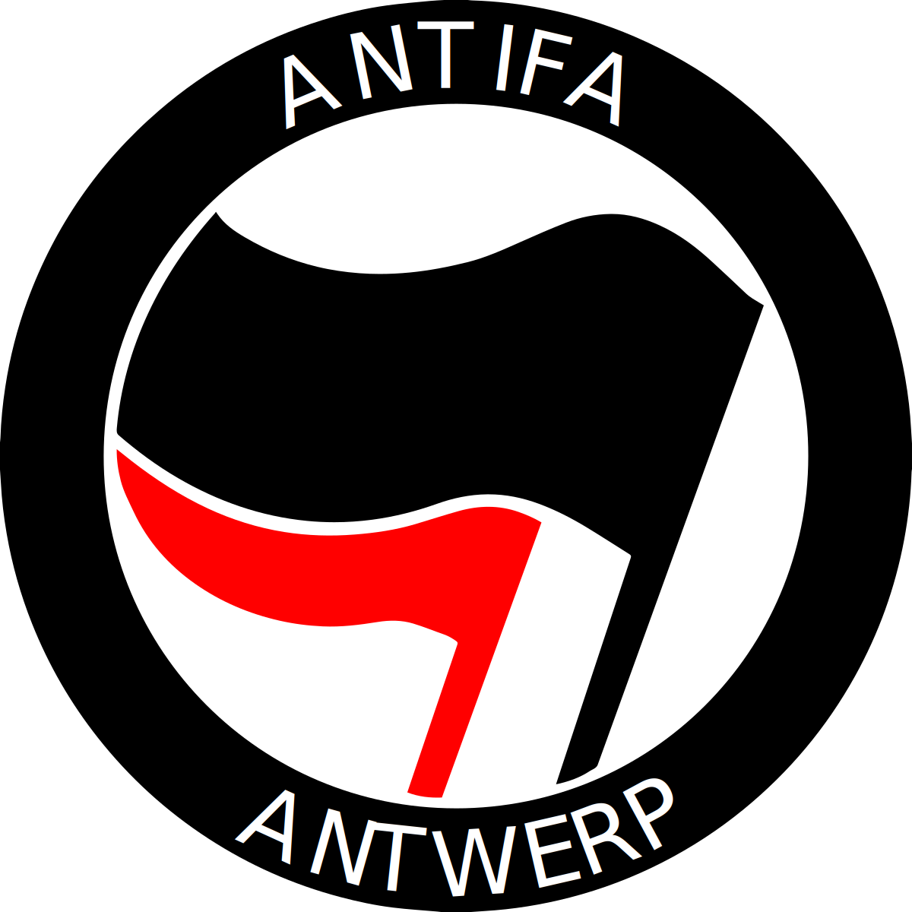

# Antifantwerp


A website collecting anti-fascist resources in Antwerp, Belgium.

## Reference
### Data
A part of being a collection of resources is collecting and displaying data. Some text (e.g. [how to remove stickers on our website](https://www.antifantwerp.org/stickers/#howto)) will be hardcoded. However, every list (e.g. [organisations](https://www.antifantwerp.org/organisations/) or watchpigeon articles [like seen in Watchpigeon Flanders](https://www.antifantwerp.org/watchpigeon/flanders/)) are available in YAML format: human+machine readable & writeable.

This data can be used by people and organisations in line with what Antifantwerp stands for. For more information on this, see [the Antifantwerp positions page](https://www.antifantwerp.org/positions/).

- Stickers: [data](src/_data/stickers/) & [images](src/assets/stickers/)
- Organisations: [data](src/_data/organisations.yaml)
- Positions: pure text, and thus hardcoded
- Watchpigeon: [data](src/_data/parties/) & [images](src/assets/parties/)
- Resources:
    - Surveillance camera locations: TODO
    - Signs: [data](src/_data/fascist_emblems.yaml) & [images](src/assets/signs/)
- Locations: possibly TODO, depending whether it falls under text or data down the road
- Contributing: text
- Thanks: text

## How-to
### Run locally
Requirements: node.js, yarn

```bash
git clone https://github.com/Antifantwerp/antifantwerp.github.io.git
cd antifantwerp.github.io
yarn install
```
Then run...
- `yarn build` to build into `dist/`
- `yarn dev` to run a dev server on [localhost:8080](http://localhost:8080).

